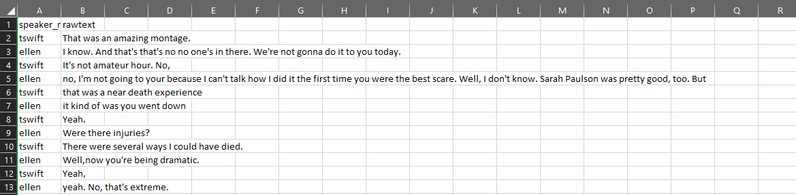

<!-- README.md is generated from README.Rmd. Please edit that file -->

```{r, include = FALSE}
knitr::opts_chunk$set(
  collapse = TRUE,
  comment = "#>",
  fig.path = "man/figures/",
  out.width = "100%"
)
```

# ConversationAlign
<!-- badges: start -->
<!-- badges: end -->

## Overview
{width=150px, height=300px} ConversationAlign is an R package for analyzing alignment between interlocutors (conversation partners) engaged in dyads (two partner conversations).  ConversationAlign will work on one or more natural language transcripts of the following file types: txt (text files), csv (comma separated values), otter.ai transcripts saved as txt files.

## Nuts and bolts
{width=200px, height=500px} 
ConversationAlign transforms raw language data into simultaneous time series objects spanning 40 possible dimensions (affective, lexical, and semantic). Here's an overview of how the package transforms language to time series data for computing alignment indices<br/>

## Caveats: Things you must be careful about!
Any analysis of language transcripts comes with assumptions and potential bias. For example, there are some instances where a researcher might care about morphemes and grammatical elements such as 'the', 'a', 'and'.  The default for ConversationAlign is to omit these as stopwords and to average across all open class words (e.g., nouns, verbs) in each turn by interlocutor. There are some specific cases where this can all go wrong. Here's what you need to consider: <br/>

1) Stopwords: The package omits stopwords. LINK here to the stopword list if you would like to inspect this list. We included greetings and idioms in the omissions list. <br/>

2) Lemmatization: The package will lemmatize your language transcripts by default. Lemmatization transforms inflected forms (e.g., standing, stands) into their root or dictionary entry (e.g., stand). This helps for yoking offline values (e.g., happiness, concreteness) to each word -- also what NLP folks refer to as term aggregation. However, sometimes you might NOT want to lemmatize.  You can easily change this option as an argument lemmatize=F to the clean_dyads function below. <br/>

3) Sample Size Issue 1 -- The program derives correlations and AUC for each dyad as metrics of alignment. If there are 40 exchanges (80 turns) between conversation partners, the R value will be computed over 40 data points. For conversations less than about 30 turns, you should not trust the R values that ConversationAlign outputs.  <br/>

4) Sample Size Issue 2 -- ConversationAlign works by yoking values from a lookup database to each word in your language transcsript. Some variables have lots of values characterizing many English words. Other variables (e.g., age of acquisition) only cover about 13k words. When a word in your transcript does not have a 'match' in the lookup datase, ConversationAlign will return an NA which will not go into the average of the words for that interlouctor and turn.  This can be dangerous when there are many missing values. Beware! <br/>

5) ConversationAlign is a caveman in its complexity. It matches a value to each word as if that word is an island. Phenomena like polysemy (e.g., bank) and the modulation of one word by an intensifier (e.g., very terrible) are not handled. This is a problem for many of the affective measures but not for lexical variables like word length. <br/>


## Installation
Install the development version of ConversationAlign from [GitHub](https://github.com/) by entering the following in your console or script:

``` {r, eval=F}
install.packages("devtools")
devtools::install_github("Reilly-ConceptsCognitionLab/ConversationAlign")
```
<br/>

# Before you start
ConversationAlign takes natural language transcripts between pairs of interlocutors. The package can handle Otter.ai formatted files, but it can also handle a home brew of your own preferred format as long as your transcript has at least two columns containing (1) identifiers for the interlocutors in the interaction (e.g., speaker names, random participant IDs) and (2) raw text from their interaction. The order of these two columns in your transcript does not matter.<br/>

Some users may be interested in analyzing distinguishable dyads, wherein members of interlocutor pairs are consistently differentiated by a meaningful characteristic (e.g., student-teacher, parent-child, boss-employee, etc.). Dyads are considered distinguishable if their members can *all* be differentiated in this way, but are considered indistinguishable if interlocutors in at least one dyad share this characteristic (e.g., parent-parent). If you do have a distinguishable grouping variable, you can either prepare a separate file with other metadata (e.g., grouping variable, age, neuropsychological assessment scores) and merge it with your finalized dataframe processed through ConversationAlign, or you can include it in your original raw transcripts and it will be retained. <br/>

## Prep your language transcripts
ConversationAlign will work on .txt or .csv files. The first (header) row of your transcript must designate the interlocutor (person producing the output) and the text. When prepping your raw transcripts, be careful to mark these columns as follows using one of these options (case-insensitive). The order of your columns does not matter:<br/>
  1) Interlocutor, Speaker, or Participant<br/>
  2) Text, Utterance, or Turn <br/>
  
{width=800px, height=200px}
  
If working with multiple transcripts, each dyadic conversation transcript should be saved as a separate file (e.g., MaryJoe_FirstDateTalk.txt). This is important for how ConversationAlign will read your data into R, append document IDs, and split each dyad into a separate list.  ConversationAlign runs many operations on each dyad and ultimately binds those data into a summary dataframe. ConversationAlign marks each conversation with a unique event_id populated from its filename (be deliberate about naming!). All other metadata (e.g., age, timestamps, grouping variables) in your language transcripts will be retained. 
<br/>
<br/>
 
Move your raw transcripts into a folder. The default folder name ConversationAlign will search for on your machine is 'my_transcripts'. However, if you want to specify your own folder name that's fine too. You will call that path as an argument to the first function called read_dyads(). 
<br/>
<br/>

## Read your transcripts into R
### read_dyads()
This function will read all your files and concatenate them into a single dataframe, appending document IDs.  You can call this dataframe whatever you like.  read_dyads will default to reading all csv and txt files in a folder called my_transcripts.  Just remember that when you are finished processing a set of transcripts, make sure to move them out of that folder. You can think of 'my_transcripts' as a staging area for loading data into ConversationAlign.
<br/>

```{r, eval=F}
MyRawLangSamples <- read_dyads()
#if you want to specify a different folder, supply your own path
MyRawLangSamples <- read_dyads("/my_custompath")
```
<br/>

## Clean your transcripts: clean_dyads
'clean_dyads' uses regular expressions to clean and format your data. The function also omits stopwords using a custom stopword list, and it lemmatizes (converts all words to their dictionary entries) unless you tell it not to (lemmatize=T is the default). Run 'clean_dyads' on the object you just assembled by running the 'read_dyads' function in the last step.
<br/>
```{r, eval=F}
MyCleanLangSamples <- clean_dyads(MyRawLangSamples) #default is lemmatize=T
#If you do NOT want your language sample lemmatized, change the lemmatize argument to F
MyCleanLangSamples <- clean_dyads(MyRawLangSamples, lemmatize=F)

```
<br/>

## Align your transcripts: align_dyads
This is where a lot of the magic happens. align_dyads will take the cleaned dataframe you created in the last step and yoke values to every word by indexing a lookup database. This database was populated with published word norms from numermous sources (e.g., afffectvec, Kuperman norms, Brysbaert norms, etc.). Yokes data to each word then structures a dataframe by speaker and exchange across each dyad. <br/>

You will be prompted to select one of more variables to yoke data to that will be used in later steps to compute alignment indices. Here are your choices: <br/>

anger, anxiety, boredom, closeness, confusion, dominance, doubt, empathy, encouragement, excitement, guilt, happiness, hope, hostility, politeness, sadness, stress, surprise, trust, valence, age of acquisition, word length (by letters), morphemes per turn, prevalence (how many people know this word), number of word senses (polysemy), word frequency (lg10), arousal, concreteness, semantic diversity, semantic neighbors <br/>

Run align_dyads on the cleaned dyads you created in the last function.
 
```{r, eval=F}
MyAlignedDyads <- align_dyads(MyCleanLangSamples)
```

## Summarize transcripts
```{r, eval=F}
#TBD
```

## Get in touch!
Contact <jamie_reilly@temple.edu> for feedback and assistance.

