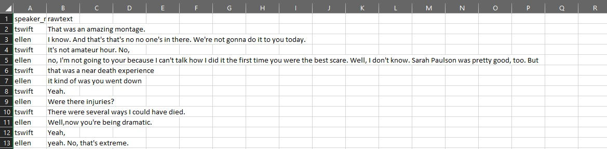
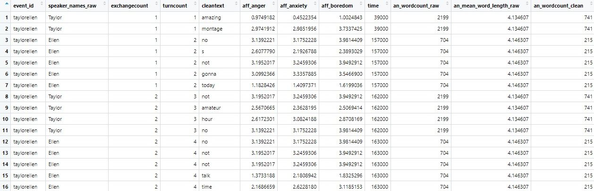

<!-- README.md is generated from README.Rmd. Please edit that file -->

# ConversationAlign

<!-- badges: start -->

[](https://github.com/reilly-lab/ConversationAlign/actions/workflows/R-CMD-check.yaml)
<!-- badges: end -->

<!-- ```{r, echo=F, out.width='70%', out.height='60%', out.extra='style="float:right; padding:5px"'} -->
<!--  knitr::include_graphics("man/figures/convo.jpeg") -->
<!-- ``` -->

ConversationAlign analyzes alignment between interlocutors (conversation
partners) engaged in two-person conversations. ConversationAlign works
on language transcripts. It can handle text files (.txt) or comma
separated value (.csv) spreadsheet style files. ConversationAlign
transforms raw language data into simultaneous time series objects
spanning 30 possible dimensions via an embedded lookup database. <br/>

# Overview

Here’s a schematic of the guts of the program…

<figure>

<figcaption aria-hidden="true">overview of
ConversationAlign</figcaption>
</figure>

# Before starting: Prep your data

ConversationAlign can handle a home brew of your own preferred format.
However, your transcripts must have the following header columns at a
bare minimum: <br/> 1) Participant identifier (named Interlocutor’,
‘Speaker’, or ‘Participant’) <br/> 2) Text (named ‘Text’, ‘Utterance’,
or ‘Turn’) <br/>

The order of your columns does not matter. Any other data in your
transcripts (e.g., metadata, timestamps, grouping variables) will be
retained. Here’s an example of a transcript that will work. Don’t worry
about stripping punctuation. We will do that for you. <br/>


<br/>

Considerations in prepping your language transcripts for
ConversationAlign: <br/>

1)  Save each conversation transcript as a separate file (e.g.,
    MaryJoe_FirstDateTalk.txt)
2)  Be careful/deliberate about your filenaming convention. The filename
    for each conversation will become its event ID in the dataframe
3)  Move all your language transcripts to be analyzed into one folder
    (e.g., “my_transcripts”) in the same directory you are running your
    R script.
4)  If you have metadata (e.g., age, timestamps, grouping variables),
    you can either append this to your original transcript or merge the
    metdata as a separate file. This is a useful option when you have
    many individual difference and demographic details.

# Installation

Install the development version of ConversationAlign from
[GitHub](https://github.com/) by entering the following in your console
or script:

``` r
install.packages("devtools")
devtools::install_github("Reilly-ConceptsCognitionLab/ConversationAlign")
```

# Read your transcripts into R

## read_dyads()

This function will read all your files and concatenate them into a
single dataframe, appending document IDs. You can call this dataframe
whatever you like. ‘read_dyads’ will default to reading all csv and txt
files in a folder called my_transcripts. Just remember that when you are
finished processing a set of transcripts, make sure to move them out of
that folder. You can think of ‘my_transcripts’ as a staging area for
loading data into ConversationAlign. <br/>

``` r
MyRawLangSamples <- read_dyads()
#if you want to specify a different folder, supply your own path
MyRawLangSamples <- read_dyads("/my_custompath")
```

| Event_ID | Participant_ID | RawText |
|:---|:---|:---|
| taylorellen | Taylor | That was an amazing montage. |
| taylorellen | Ellen | I know. And that’s that’s no no one’s in there. We’re not gonna do it to you today. |
| taylorellen | Taylor | It’s not amateur hour. No, |
| taylorellen | Ellen | no, I’m not going to your because I can’t talk how I did it the first time you were the best scare. Well, I don’t know. Sarah Paulson was pretty good, too. But |
| taylorellen | Taylor | that was a near death experience |
| taylorellen | Ellen | it kind of was you went down |
| taylorellen | Taylor | Yeah. |
| taylorellen | Ellen | Were there injuries? |
| taylorellen | Taylor | There were several ways I could have died. |
| taylorellen | Ellen | Well,now you’re being dramatic. |
| taylorellen | Taylor | Yeah, |
| taylorellen | Ellen | yeah. No, that’s extreme. |
| taylorellen | Taylor | Yeah. |
| taylorellen | Ellen | It- I really just was watching that backstage. And I was just thinking like, thank you so much for going so above and beyond to make people happy. Yeah, |
| taylorellen | Taylor | well, |
| taylorellen | Ellen | that’s not a good example of it |

<!-- <br/> -->
<!-- {width=400px, height=600px} <br/> -->

# Clean your transcripts

## clean_dyads()

‘clean_dyads’ uses numerous regex to clean and format the data your just
read into R in the previous step. Although there are many cleaning
steps, here are the big ones: 1) to lowercase 2) omit stopwords 3)
replace contractions (e.g., ‘you’re’ to ‘you are’) 4) tick marks to
apostrophes 5) hypens to spaces 6) omits numerals 7) omits/squishes
extraneous white space 8) lemmatization <br/>

ConversationAlign calls the textstem package as a dependency to
lemmatize your language transcript. This converts morphologiocal
derivatives to their root forms. The default is lemmatize=T. Sometimes
you want to retain language output in its native form. If this is the
case, change the argument in clean_dyads to lemmatize=F. <br/>

‘clean_dyads’ outputs word count metrics pre/post cleaning by dyad and
interlocutor. This can be useful if you are interested in whether one
person just doesn’t produce many words or produces a great deal of empty
utterances.<br/>

``` r
MyCleanLangSamples <- clean_dyads(MyRawLangSamples) #default is lemmatize=TRUE
#If you do NOT want your language sample lemmatized, change the lemmatize argument to F or FALSE
MyCleanLangSamples <- clean_dyads(MyRawLangSamples, lemmatize=FALSE)
```

| Event_ID | Participant_ID | TurnCount | CleanText | NWords_ByPersonTurn_RAW | NWords_ByPersonTurn_CLEAN |
|:---|:---|---:|:---|---:|---:|
| taylorellen | Taylor | 1 | amazing | 5 | 2 |
| taylorellen | Taylor | 1 | montage | 5 | 2 |
| taylorellen | Ellen | 2 | no | 18 | 5 |
| taylorellen | Ellen | 2 | s | 18 | 5 |
| taylorellen | Ellen | 2 | not | 18 | 5 |
| taylorellen | Ellen | 2 | gonna | 18 | 5 |
| taylorellen | Ellen | 2 | today | 18 | 5 |
| taylorellen | Taylor | 3 | not | 5 | 4 |
| taylorellen | Taylor | 3 | amateur | 5 | 4 |
| taylorellen | Taylor | 3 | hour | 5 | 4 |
| taylorellen | Taylor | 3 | no | 5 | 4 |
| taylorellen | Ellen | 4 | no | 33 | 12 |
| taylorellen | Ellen | 4 | I | 33 | 12 |
| taylorellen | Ellen | 4 | not | 33 | 12 |
| taylorellen | Ellen | 4 | not | 33 | 12 |

<!-- {width=300px, height=400px} <br/> -->

# Align your transcripts

## align_dyads()

This is where a lot of the magic happens. align_dyads will take the
cleaned dataframe you created in the last step and yoke values to every
word by indexing a lookup database. The “align” step yokes data to each
word in the cleaned transcript text then structures a dataframe by
speaker (“Participant_ID”), exchange (“exchangecount”), and turn
(“turncount”) across each dyad (“event_id”). <br/>

You will be prompted to select one of more variables (and up to three)
to yoke data to that will be used in later steps to compute alignment
indices. You will be shown a menu wherein you can select up to three
variables to be yoked to your text. Following the menu steps, enter the
number of each variable you would like with a space separating values
(e.g., “10 14 19”). <br/>

Here are your choices: <br/>

anger, anxiety, boredom, closeness, confusion, dominance, doubt,
empathy, encouragement, excitement, guilt, happiness, hope, hostility,
politeness, sadness, stress, surprise, trust, valence, age of
acquisition, word length (by letters), morphemes per turn, prevalence
(how many people know this word), number of word senses (polysemy), word
frequency (lg10), arousal, concreteness, semantic diversity, and
semantic neighbors. <br/>

Variable key here: <br/>
<https://reilly-lab.github.io/ConversationAlign_VariableLookupKey.pdf>
<br/> <br/>

ConversationAlign will prompt you to append any metadata you would like
to add. This joins information from a separate file (e.g., neuropsych
scores, ages, etc). Just give ConversationAlign a filepath to your CSV
data or click “Enter” to skip this step. A metadata file might look like
this:

METADATA IMAGE HERE <br/>

Run align_dyads on the cleaned dyads object you created using the
clean_dyads function.<br/>

``` r
MyAlignedDyads <- align_dyads(MyCleanLangSamples)
```


<br/>

# Summarize transcripts

This last step consists of three methods, each of which computes a
seperate index of alignment.

## summarize_dyads_auc()

This returns the difference time series AUC (dAUC) for every variable of
interest you specified. For example, summarize_dyads_auc will append
dAUC values for hostility (if that’s what you’re interested in). <br/>

## summarize_dyads_covar()

This returns a spearman correlation coefficient and range of lagged
Pearson correlation coefficients for each variable of interest. A vector
of Lags/leads for Pearson correlations are supplied as a parameter.
<br/>

## summarize_dyads_slope()

This return the intercept and slope of a simple linear regression for
each interlocutor and the difference time series over each variable of
interest. This provides a measure of change over time, providing
information on who aligns to whom. <br/>
<!-- Link here to read more about what dAUC, Spearman, and slope mean in the context of alignment (or look at the figure above for an illustration): LINK TO METHOD -->

``` r
MyFinalDataframe_AUC <- summarize_dyads_auc(MyAlignedDyads, resample = T) #resample=T computes AUC by homogenizing the length of all dyads to the shortest tramscript (number of turns) 

MyFinalDataframe_Covar <- summarize_dyads_covar(MyAlignedDyads, lags = c(-2, -1, 1, 2)) # lags are supplied as a vector, defaulting to a range of [-3, 3]

MyFinalDataframe_Slope <- summarize_dyads_slope(MyAlignedDyads, resample = F) # for auc and slope, when resample=F, it becomes much more difficult to compare metrics between conversations of different lengths.
```

# Caveat emptor

## Things you must be careful about

Any analysis of language comes with assumptions and potential bias. For
example, there are some instances where a researcher might care about
morphemes and grammatical elements such as ‘the’, ‘a’, ‘and’, etc.. The
default for ConversationAlign is to omit these as stopwords and to
average across all open class words (e.g., nouns, verbs) in each turn by
interlocutor. There are some specific cases where this can all go wrong.
Here’s what you need to consider: <br/>

1.  <span style="color:red;">Stopwords </span>: The package omits
    stopwords. [See the stopword list here](https://osf.io/atf5q/) if
    you would like to inspect this list. We included greetings, idioms,
    filler words, numerals, and pronouns in the omissions list. <br/>

2.  <span style="color:red;">Lemmatization </span>: The package will
    lemmatize your language transcripts by default. Lemmatization
    transforms inflected forms (e.g., standing, stands) into their root
    or dictionary entry (e.g., stand). This helps for yoking offline
    values (e.g., happiness, concreteness) to each word and also entails
    what NLP folks refer to as ‘term aggregation’. However, sometimes
    you might NOT want to lemmatize. You can easily change this option
    by using the argument, “lemmatize=FALSE,” to the clean_dyads
    function below. <br/>

3.  <span style="color:red;">Sample Size Issue 1: exchange count</span>:
    The program derives correlations and AUC for each dyad as metrics of
    alignment. If there are 40 exchanges (80 turns) between conversation
    partners, the R value will be computed over 40 data points. For
    conversations less than about 30 turns, you should not trust the R
    values that ConversationAlign outputs. <br/>

4.  <span style="color:red;">Sample Size Issue 2 </span>: matching to
    lookup database: ConversationAlign works by yoking values from a
    lookup database to each word in your language transcript. Some
    variables have lots of values characterizing many English words.
    Other variables (e.g., age of acquisition) only cover about 30k
    words. When a word in your transcript does not have a ‘match’ in the
    lookup datase, ConversationAlign will return an NA which will not go
    into the average of the words for that interlocutor and turn. This
    can be dangerous when there are many missing values. Beware! <br/>

5.  <span style="color:red;">Compositionality </span>: ConversationAlign
    is a caveman in its complexity. It matches a value to each word as
    if that word is an island. Phenomena like polysemy (e.g., bank) and
    the modulation of one word by an intensifier (e.g., very terrible)
    are not handled. This is a problem for many of the affective
    measures but not for lexical variables like word length. <br/>

6.  <span style="color:red;"> Resampling for AUC </span>:
    summarize_dyads will output AUC values quantifying the distance
    between interlocutors on any dimension you specify. AUC will vary
    depending on the length of the dyad. Therefore, it is often
    necessary to resample (downsample) your dyads so that they are all
    of an equivalent length. This will get very wonky and
    uninterpretable for very short exchanges.

# Background

Here are some documents describing how we derived our stopword list and
lookup databases.

Our OSF site for this method paper is here: <https://osf.io/atf5q/>

Read more about how we created the internal lookup_database for
ConversationAlign here:
<https://reilly-lab.github.io/ConversationAlign_LookupDb_Methods.pdf>

Read more about the variables we have included to align on by linking
here:
<https://reilly-lab.github.io/ConversationAlign_VariableLookupKey.pdf>

You can read more about the nature of the stopword list and view it
here:
<https://reilly-lab.github.io/ConversationAlign_StopwordsDb_Methods.pdf>

# Get in touch!

Contact <jamie_reilly@temple.edu> for feedback and assistance.
